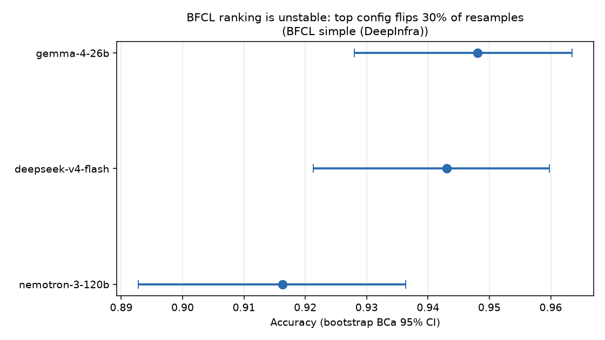
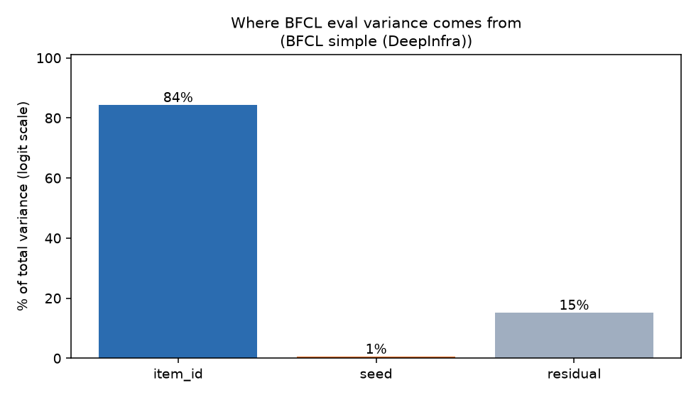

# AgentStat

> A statistical rigor toolkit for LLM/agent evaluation.
> Bootstrap CIs, variance decomposition, power analysis, and significance testing —
> one function call each, plus a reproducible demo that a real benchmark ranking
> **does not survive resampling**.

---

## The headline: a leaderboard that reorders under resampling

We ran three tool-calling models on 199 items of the **BFCL "simple"** benchmark
(3 seeds each, via DeepInfra) and asked one question: *is the ranking real?*



| Config | Accuracy | 95% CI (bootstrap BCa) |
|---|---|---|
| gemma-4-26b | **0.948** | [0.928, 0.964] |
| deepseek-v4-flash | 0.943 | [0.921, 0.960] |
| nemotron-3-120b | 0.916 | [0.893, 0.936] |

By point estimate, `gemma-4-26b` is the "best" config. But that claim is **not
supported by the data**:

- The top rank **flips in 30% of bootstrap resamples**. The full ranking people
  would quote is only the *most frequent* one **68%** of the time.
- The gemma-vs-deepseek gap of **0.5 points** has a 95% CI of **[−1.2%, +2.2%]**
  — it spans zero. A paired permutation test gives **p = 0.74**; the probability
  gemma truly beats deepseek is only **0.70**, barely better than a coin flip.

So "gemma-4-26b > deepseek-v4-flash on BFCL-simple" is a coin flip dressed up as
a ranking. **A single accuracy number with no error bar is not a result.**

## Where does the noise come from?

`agent_variance` / `decompose_variance` fit a logistic mixed model and partition
the score variance across factors:



**84% of the variance is *which items you sampled*** (item difficulty); seed
nondeterminism is ~1%. The practical consequence: adding more *seeds* barely
tightens your estimate — adding more *items* does. Most eval reports spend their
compute budget in the wrong place.

---

## Positioning (honest framing)

Statistical treatment of LLM evals exists in the literature (benchmark-variance
studies, bootstrap tutorials, power-analysis recommendations). This project's
pitch is **not** novelty of method — it's that these methods are known but rarely
applied, and here they are as one function call each, with a reproduction on a
benchmark people actually use.

The one genuinely under-explored slice is **variance decomposition for agent
systems** — partitioning across seed / tool-call / multi-turn-trajectory sources,
not just single-shot output. `agent_variance()` is that extension.

**A caveat we keep honest:** variance-component estimates on *binary* pass/fail
data are attenuated (biased toward zero). Read the decomposition as *relative*
shares — which source dominates — not exact absolute variances. This is
documented in `core/variance.py` and enforced in its tests.

---

## What's in the box

| Feature | Function | Method |
|---|---|---|
| Confidence intervals | `bootstrap_ci` | percentile / BCa (wraps `scipy.stats.bootstrap`) |
| Paired comparison | `paired_bootstrap_diff` | CI on a−b + P(a>b), paired by item |
| Variance decomposition | `decompose_variance`, `agent_variance` | logistic mixed model (crossed random effects) |
| Power analysis | `required_n`, `achieved_power` | effect size + variance → required n |
| Significance | `permutation_test`, `fdr_correct` | permutation + Benjamini–Hochberg |
| **Ranking stability** | `ranking_stability` | resample → re-rank → flip probability |

Everything consumes one data contract, `EvalResult` (`data/schema.py`).

## Setup

Requires Python 3.12+ and [uv](https://docs.astral.sh/uv/).

```bash
uv sync --extra dev --extra plot     # venv + install
uv run pytest                        # 91 tests, stats validated vs scipy + ground truth
```

## Reproduce the headline

```bash
cp .env.example .env                 # add DEEPINFRA_API_KEY (or OPENROUTER_API_KEY)
uv run python experiments/run_bfcl.py            # run the benchmark (cached; ~$0.05, ~7 min)
uv run python experiments/01_ranking_instability.py   # -> figures/01_ranking_instability.png
uv run python experiments/02_agent_variance.py        # -> figures/02_variance_components.png
```

No API key? Both experiments fall back to a frozen semi-synthetic fixture
(`harness/fixture.py`) so the full pipeline runs offline.

## How it's built

```
EvalResult ─┬─> core/       bootstrap · variance · power · significance
            ├─> ranking/    stability (the headline)
            └─> harness/    providers (OpenAI-compatible) · disk cache · BFCL loader/scorer · runner
                            experiments/ read the runner's output, write figures/
```

Design rules: `core/` has zero harness imports; every stats primitive is
validated against synthetic ground truth or scipy itself; the runner enforces a
shared item set across configs (the paired-resample invariant the ranking and
paired-bootstrap functions depend on); every API call is cached, so reruns cost
nothing.

## License

MIT
