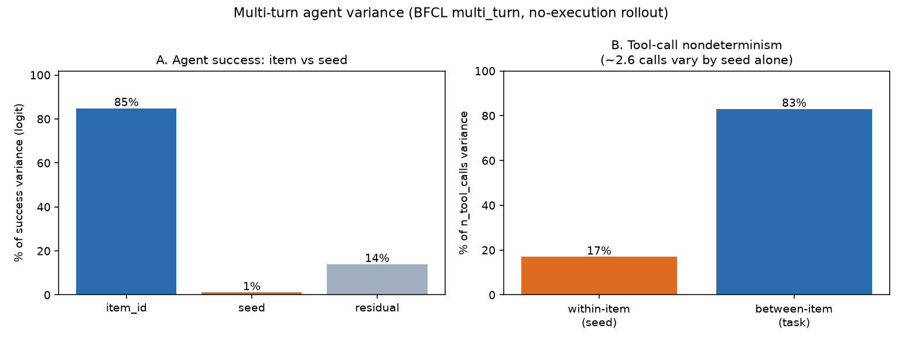

# AgentStat

> A statistical rigor toolkit for LLM/agent evaluation.
> Bootstrap CIs, variance decomposition, power analysis, and significance testing —
> one function call each, plus a reproducible demo of **which leaderboard
> differences are real and which are noise**.

---

## The headline: some of the leaderboard is real, some is a coin flip

We ran three tool-calling models on **381 items** of the **BFCL "simple"**
benchmark (3 seeds each, via DeepInfra) and asked, for every pair: *is this
ranking real, or noise?*


| Config | Accuracy | 95% CI (bootstrap BCa) |
|---|---|---|
| deepseek-v4-flash | **0.948** | [0.934, 0.960] |
| gemma-4-26b | 0.927 | [0.911, 0.941] |
| nemotron-3-120b | 0.910 | [0.892, 0.925] |

Point estimates give a clean ranking `deepseek > gemma > nemotron`. But only
**part** of it survives scrutiny:

- **The top is real.** `deepseek > gemma` holds: the top rank flips in just **1%**
  of resamples, the paired difference CI is **[−4.0%, −0.3%]** (excludes zero),
  permutation **p = 0.036**.
- **The middle is not.** `gemma > nemotron` is **not** significant: the paired
  difference CI is **[−0.8%, +4.2%]** (spans zero), **p = 0.21**, and gemma only
  outranks nemotron in **90%** of resamples. Reported as a ranking, that 2nd-vs-3rd
  ordering is a coin-flip-ish call dressed up as a result.

So even at ~380 items, one of three pairwise orderings on this leaderboard isn't
supported by the data. **A ranking is a set of pairwise claims, and they don't all
pass — which ones do is exactly what a significance test tells you, and a bare
accuracy table hides.**

> *Sample size matters, visibly:* at 199 items (an earlier run) the **top** pair
> was itself a coin flip — the winner flipped 30% of resamples. Doubling to ~380
> items resolved the top but left the middle unresolved. Validity scales with n,
> and most reported evals use the smaller one.

## Where does the noise come from?

`agent_variance` / `decompose_variance` fit a logistic mixed model and partition
the score variance across factors:


**84% of the variance is *which items you sampled*** (item difficulty); seed
nondeterminism is **0.3%**. The practical consequence: adding more *seeds* barely
tightens your estimate — adding more *items* does. (This is exactly why doubling
the item count above resolved the top ranking while re-running seeds would not
have.) Most eval reports spend their compute budget on the wrong axis.

## The agent extension: outcome is stable, *process* is not

The single-turn work above measures *whether* a model answers correctly. For a
multi-turn agent there's a second axis single-turn evals have no equivalent for:
*how many steps it takes to get there*. We ran a no-execution rollout over BFCL's
`multi_turn` episodes (57 tasks × 3 seeds) and decomposed both.



- **Panel A — success variance looks just like single-turn.** Item 85%, seed 1%.
  So the popular worry that agent *success* is seed-fragile **did not hold here** —
  outcome variance is dominated by which task you picked, same as single-turn.
- **Panel B — but the *trajectory* is highly nondeterministic.** On the **identical
  task**, the agent's tool-call count varies by **~2.6 calls (SD)** across seeds;
  **58% of tasks** produce a different number of tool calls on rerun, and the
  extremes are large — one task ranges **14→46 calls**, another **34→62**, purely
  from the seed.

**The takeaway:** *whether* the agent succeeds is stable across seeds; *how* it
gets there is not. Cost, latency, and reliability all live in that process
variance — and a success-only metric (all that single-turn analysis can see) is
blind to it. Measuring only pass/fail understates agent-eval noise on every axis
except the one people report.

> **Honesty caveat:** this uses a *no-execution* rollout (tool calls are counted,
> not executed against real state) and a *proxy* success signal (recall of
> ground-truth call names), so it is a **variance demonstration, not an official
> BFCL score**. The trajectory-variance result stands regardless — it's about the
> spread of the agent's own behavior — but the absolute success rate is a proxy.
> Vendoring BFCL's stateful scorer is the follow-up if a citable number is needed.

---

## Positioning (honest framing)

Statistical treatment of LLM evals exists in the literature (benchmark-variance
studies, bootstrap tutorials, power-analysis recommendations). This project's
pitch is **not** novelty of method — it's that these methods are known but rarely
applied, and here they are as one function call each, with a reproduction on a
benchmark people actually use.

The one genuinely under-explored slice is **variance decomposition for agent
systems** — partitioning across seed / tool-call / multi-turn-trajectory sources,
not just single-shot output. `agent_variance()` is that extension.

**A caveat we keep honest:** variance-component estimates on *binary* pass/fail
data are attenuated (biased toward zero). Read the decomposition as *relative*
shares — which source dominates — not exact absolute variances. This is
documented in `core/variance.py` and enforced in its tests.

---

## What's in the box

| Feature | Function | Method |
|---|---|---|
| Confidence intervals | `bootstrap_ci` | percentile / BCa (wraps `scipy.stats.bootstrap`) |
| Paired comparison | `paired_bootstrap_diff` | CI on a−b + P(a>b), paired by item |
| Variance decomposition | `decompose_variance`, `agent_variance` | logistic mixed model (crossed random effects) |
| Power analysis | `required_n`, `achieved_power` | effect size + variance → required n |
| Significance | `permutation_test`, `fdr_correct` | permutation + Benjamini–Hochberg |
| **Ranking stability** | `ranking_stability` | resample → re-rank → flip probability |

Everything consumes one data contract, `EvalResult` (`data/schema.py`).

## Setup

Requires Python 3.12+ and [uv](https://docs.astral.sh/uv/).

```bash
uv sync --extra dev --extra plot     # venv + install
uv run pytest                        # 102 tests, stats validated vs scipy + ground truth
```

## Reproduce the findings

```bash
cp .env.example .env                 # add DEEPINFRA_API_KEY (or OPENROUTER_API_KEY)

# Single-turn: ranking instability + variance (figures 01, 02)
uv run python experiments/run_bfcl.py            # run the benchmark (cached; ~$0.05, ~7 min)
uv run python experiments/01_ranking_instability.py
uv run python experiments/02_agent_variance.py

# Multi-turn agent: the two-panel trajectory-variance finding (figure 03)
uv run python experiments/run_multiturn.py       # no-execution rollouts (cached)
uv run python experiments/03_agent_variance.py
```

No API key? Both experiments fall back to a frozen semi-synthetic fixture
(`harness/fixture.py`) so the full pipeline runs offline.

## How it's built

```
EvalResult ─┬─> core/       bootstrap · variance · power · significance
            ├─> ranking/    stability (the headline)
            └─> harness/    providers (OpenAI-compatible) · disk cache · BFCL loader/scorer · runner
                            experiments/ read the runner's output, write figures/
```

Design rules: `core/` has zero harness imports; every stats primitive is
validated against synthetic ground truth or scipy itself; the runner enforces a
shared item set across configs (the paired-resample invariant the ranking and
paired-bootstrap functions depend on); every API call is cached, so reruns cost
nothing.

## License

MIT
